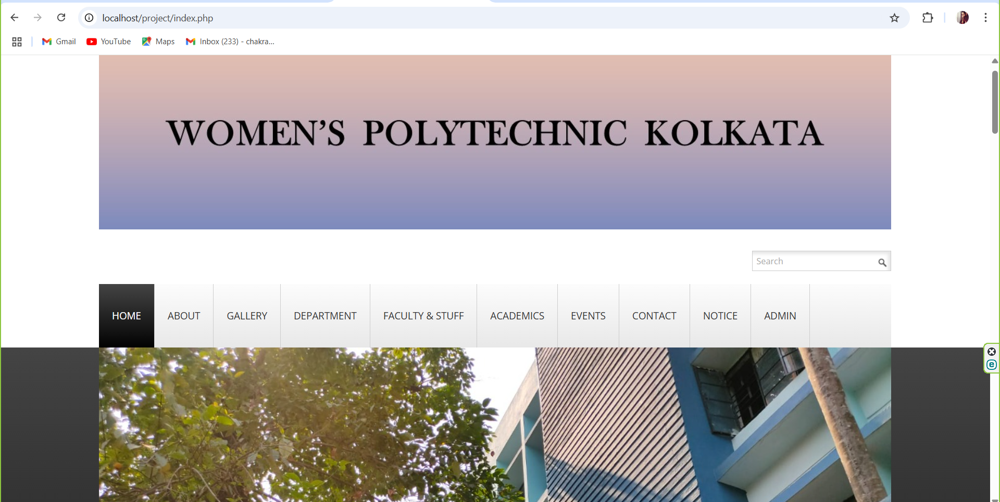
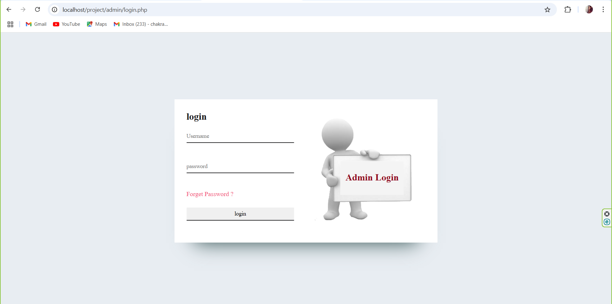
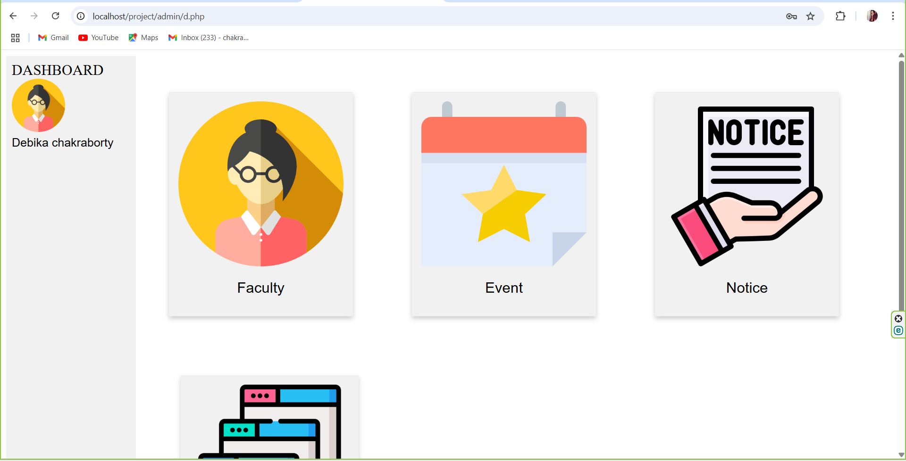

# College-website
<h2><b>📌 Project Overview</b></h2>

A responsive college website built as part of my Diploma Final Year Project (2023).
It provides details about departments, faculty, courses, and notices, along with a student login system for accessing results and academic updates.

<h2><b>🚀 Features</b></h2>

📑 Homepage with college details

🏫 Department & faculty information pages

🔐 Admin login to make academic updates

📲 Responsive design for mobile and desktop

⚡ Easy-to-use navigation

<h2><b>🛠️ Tech Stack</b></h2>

Frontend: HTML, CSS, JavaScript

Backend: PHP

Database: MySQL

<h2><b>📂 Project Structure</b></h2>
├── index.html        # Homepage  
├── about.html        # About College  
├── departments/      # Department pages  
├── faculty/          # Faculty info pages  
├── student/          # Student login and results  
├── assets/           # CSS, JS, Images  
└── database.sql      # Database schema

<h2><b>👩‍💻 Role</b></h2>

Designed frontend UI (HTML, CSS, JS)

Built backend logic with PHP

Integrated MySQL database for storing results and notices

<b><h2>📸 Screenshots</h2></b>

 
 

<h2><b>📦 Installation & Usage</b></h2>

Clone the repository

git clone https://github.com/your-username/college-website.git

Import database.sql into MySQL

Run the project on XAMPP/WAMP/LAMP server

Access it at http://localhost/college-website

<h2><b>🔮 Future Improvements</b></h2>

Add online admission form 
Implement student result checking system with secure login 
Event gallery
